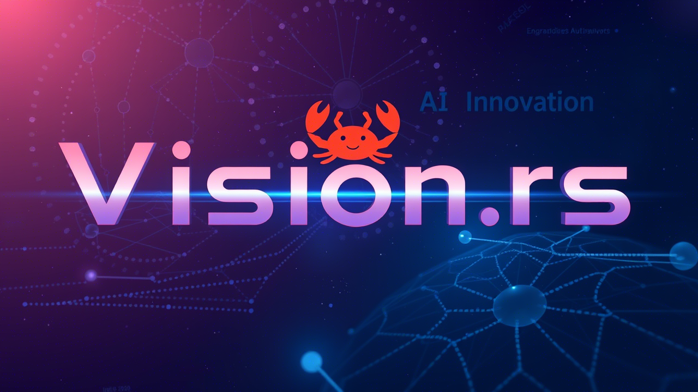

# Vision.rs
Vision.rs is a high-performance computer vision library written in Rust.
It leverages Rust’s speed and safety for efficient image processing and offers a gRPC API for building scalable microservices. This enables seamless integration and remote inference in distributed systems.

## Features

- **High Performance:** Utilizes Rust for safe and fast execution.
- **Scalable Microservices:**  gRPC API makes it easy to integrate with microservice architectures.
- **Remote Inference:** Supports remote inference for flexible deployment.
- **CUDA Support:** Optionally enable CUDA for hardware acceleration.

## Prerequisites

- **Rust:** Ensure that you have Rust installed. Visit [rust-lang.org](https:www.rust-lang.org)
  for installation instructions.
- **Protoc:** Verify that the Protocol Buffer compiler (`protoc.exe`) is correctly configured.
  You may need to update the path on line 6 of `build.rs` if necessary.
- **CUDA (Optional):** Install CUDA drivers and libraries if you plan to run with GPU support.

## Running the Application

To run Vision.rs using the provided YOLOv8n ONNX model and an input image, execute the following command:

```bash
cargo run --release -- --model assets/weights/yolov8n.onnx
```

To enable CUDA support, append the `--cuda` flag along with the device ID:

```bash
cargo run --release -- --model assets/weights/yolov8n.onnx --cuda --device_id <id>
```

## Generating Python gRPC Scripts

To generate Python encoding/decoding scripts for gRPC communication, run:

```bash
python -m grpc_tools.protoc -I./proto --python_out=. --grpc_python_out=. ./proto/result.proto
```

This command creates the necessary Python files based on your gRPC `.proto` definitions.

## Contributing

Contributions are welcome! If you have any suggestions or improvements, please open an issue or submit a pull request.